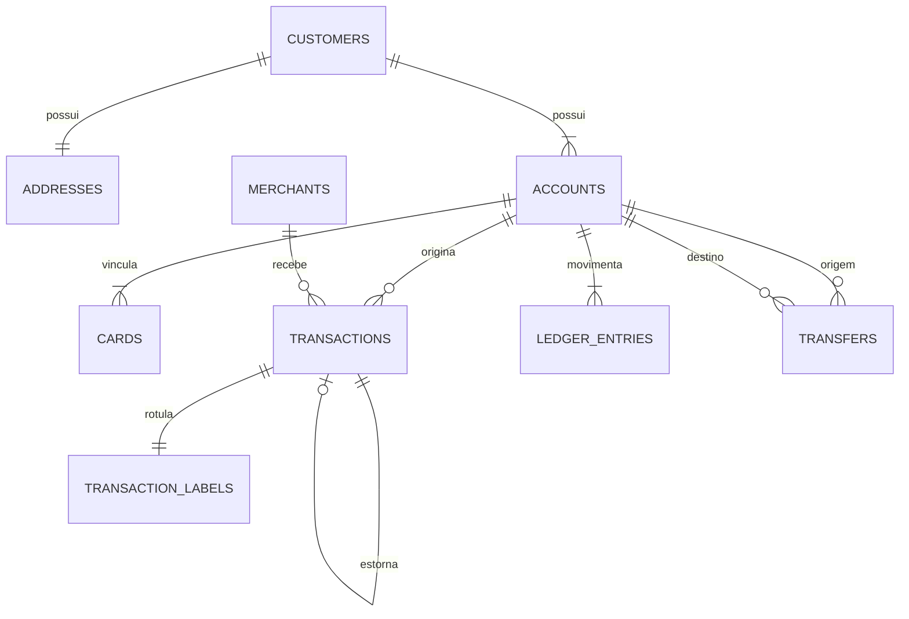

# Relacionamentos dos dados

O envelope e a publicação de eventos financeiros estão detalhados em
[event-hubs-contract.md](event-hubs-contract.md).

## Cardinalidades e integridade

| Relação | Cardinalidade | Regra |
|---|---|---|
| customer → address | 1 : 1 nesta versão | Cada cliente tem exatamente um endereço principal; múltiplos endereços ficam para o futuro. |
| customer → account | 1 : N | Cada cliente tem de `min_per_customer` a `max_per_customer`, mínimo 1. |
| account → card | 1 : N | Cada conta tem `cards.per_account` cartões, todos `debit`. |
| account → transaction | 1 : N | Compras e estornos referenciam conta existente; cartão e conta devem coincidir. |
| merchant → transaction | 1 : N | Cada tentativa referencia estabelecimento existente. |
| transaction → reversal | 1 : 0..1 | Estorno integral referencia uma compra aprovada e não cria cadeia. |
| account → ledger_entry | 1 : N | Toda conta tem uma abertura; demais lançamentos derivam de eventos válidos. |
| account → transfer (origem/destino) | 1 : N | Transferência interna usa duas contas distintas existentes e moeda coerente. |
| transaction → transaction_label | 1 : 1 (compras) | Cada tentativa original tem exatamente um rótulo; estornos não têm rótulo. |

## Diagrama

## Regras referenciais e contábeis

- IDs são sintéticos e únicos no conjunto canônico: `SYN-CUS`, `SYN-ADR`,
  `SYN-ACC`, `SYN-CRD`, `SYN-MER`, `SYN-TXN`, `SYN-TRF` e `SYN-ENT`.
- `addresses.customer_id`, `accounts.customer_id`, `cards.account_id`,
  `transactions.account_id/card_id/merchant_id`, `transfers` de origem/destino
  e labels devem apontar para registros existentes.
- `original_transaction_id` é nulo em compras e obrigatório em estornos; um
  estorno só referencia compra aprovada, uma única vez.
- Cada aprovação tem um débito; cada estorno tem um crédito integral; cada
  transferência concluída tem débito e crédito iguais. Recusas não alteram o
  ledger.
- O saldo é recalculado exclusivamente do ledger e não pode ficar negativo.
  Transferências conservam o saldo agregado.
- `event_at`/`effective_at` governam a ordem econômica e financeira. A ordem
  física pode seguir `ingested_at` em `late_event`; isso não altera saldos.
- O ground truth de fraude fica em `transaction_labels.csv`, separado de
  `transactions.csv`, e não tem efeito contábil.
- Cenários inválidos são cópias do conjunto canônico: apenas a mutação
  declarada deve ser observada, e o cenário `valid` permanece íntegro.
